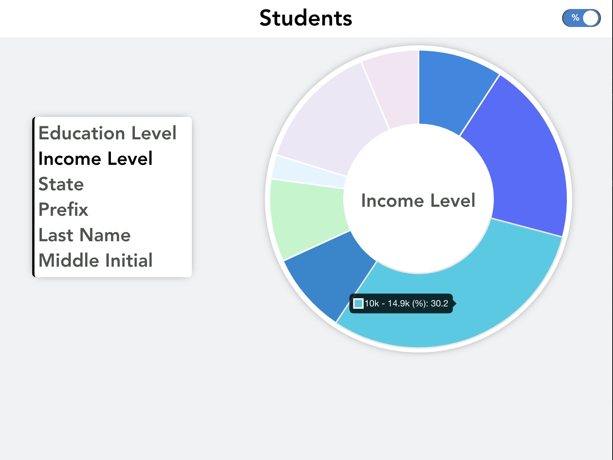

# **Vue.js Frontend**

### Grant Menke

### 3/3/2022

#### [GitHub](https://github.com/gmenke54) | [LinkedIn](https://www.linkedin.com/in/grant-menke-b81490223/) | [Portfolio](www.grantmenke.com)

## **_Description_**

This is a browser-based application written in Ruby on Rails and Vue.js deployed on Heroku and Surge.sh.

**Backend:** [Github](https://github.com/gmenke54/Education_API) | [Deployed](https://ruby-api.herokuapp.com/students/)
**Frontend:** [Github](https://github.com/gmenke54/Education_App) | [Deployed](https://ruby-app.surge.sh/)

---

## **_Screenshots_**

Final Application Screenshot:

---

## **_Technologies_**

- Ruby on Rails
- Vue.js
- Javascript

---

## **_Getting Started_**

1. Navigate to the [deployed site](https://ruby-app.surge.sh/)
2. Select the field you would like to view the data according to
3. Toggle between displaying the percent or number of students in each category

---

## **_Credits_**

**Data Mapping Plugin:** [Chart.js, Vue-Chart-3](https://vue-chart-3.netlify.app/)

**Toggle Button Plugin:** [VueForm](https://github.com/vueform/toggle)